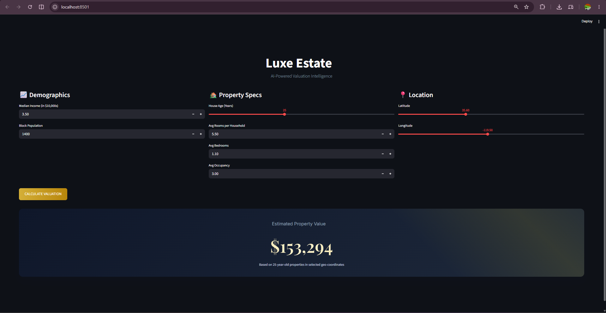

# 🏠 House Price Prediction


> Predict house prices using property features with advanced regression techniques and gradient boosting.

## 🎯 Objective

Predict house prices based on property features (size, bedrooms, location, etc.) using multiple regression models including Gradient Boosting. Compare models and build an interactive price estimator.

## 📚 What You'll Learn

- **Feature engineering** (creating new features from existing ones)
- **Handling categorical data** (one-hot encoding, label encoding)
- **Advanced regression** (XGBoost, LightGBM, Gradient Boosting)
- **Regularization** (Ridge, Lasso — when and why)
- **Residual analysis** (understanding where your model fails)
- **Model evaluation** (MAE, RMSE, R², adjusted R²)
- **Feature scaling** decisions (when it matters vs when it doesn't)

## 🧠 Concepts to Revise Before Starting

| Concept | Resource |
|---------|----------|
| Gradient Boosting | [StatQuest Video](https://www.youtube.com/watch?v=3CC4N4z3GJc) |
| XGBoost | [StatQuest XGBoost](https://www.youtube.com/watch?v=OtD8wVaFm6E) |
| Ridge & Lasso | [StatQuest Regularization](https://www.youtube.com/watch?v=Q81RR3yKn30) |
| One-Hot Encoding | [Encoding Guide](https://www.youtube.com/watch?v=9yl6-HEY7_s) |
| MAE vs RMSE | [Evaluation Metrics](https://www.youtube.com/watch?v=LbX4X71-TFI) |
| Feature Engineering | [Feature Engineering Guide](https://www.youtube.com/watch?v=68ABAU_V8qI) |

## 📁 Project Structure

```
house-price-prediction/
├── README.md
├── requirements.txt
├── .gitignore
├── Dockerfile
├── notebooks/
│   └── house_price_analysis.ipynb     ← Main analysis notebook
├── src/
│   ├── __init__.py
│   ├── data_loader.py                 ← Load & clean dataset
│   ├── feature_engineering.py         ← Create & transform features
│   ├── model.py                       ← Train & evaluate models
│   └── visualize.py                   ← Plotting functions
├── data/                               ← Kaggle house price dataset
├── models/                             ← Saved trained models
├── results/                            ← Plots and metrics
└── app/
    └── streamlit_app.py                ← House price estimator UI
```

## 🚀 Step-by-Step Implementation Guide

### Step 1: Big Data Model Training (Google Colab)
To handle large-scale datasets, we utilize Google Colab for training:
1. Open `notebooks/Colab_BigData_Training.ipynb` in Google Colab.
2. The notebook automatically fetches the California Housing Dataset and artificially scales it to **over 1 Million rows** to test memory optimization and processing limits.
3. It performs memory downcasting, feature scaling, and trains an optimized **XGBoost Regressor** (`tree_method='hist'`).
4. The notebook automatically downloads the trained pipeline as `xgboost_house_model.pkl`.

### Step 2: Setup Local Environment
Move the downloaded `xgboost_house_model.pkl` file into the `models/` directory of this project.

```bash
conda create -n house-price python=3.11 -y
conda activate house-price
pip install -r requirements.txt
```

### Step 3: Streamlit Dashboard (`app/streamlit_app.py`)
Run the premium real-estate dashboard locally:
```bash
python -m streamlit run app/streamlit_app.py
```
- The dashboard features a "Luxe Estate" premium design.
- Input demographics, property specs, and geospatial coordinates.
- Get instant, AI-driven property valuation based on the 1M+ row XGBoost model.

## 📊 Results

### Model Performance (XGBoost on 1M+ rows)
The model was evaluated on a 20% holdout set:
| Metric | Value |
|-------|-----|
| RMSE | 0.53 |
| MAE | 0.35 |
| R² | 0.79 |

### 📸 Screenshots
<p align="center">
  
</p>

## 🔗 Links

- **Engine:** XGBoost / Scikit-Learn
- **Internship:** DevelopersHub Corporation AI/ML Engineering

---
*Built as part of DevelopersHub Corporation AI/ML Engineering Internship*